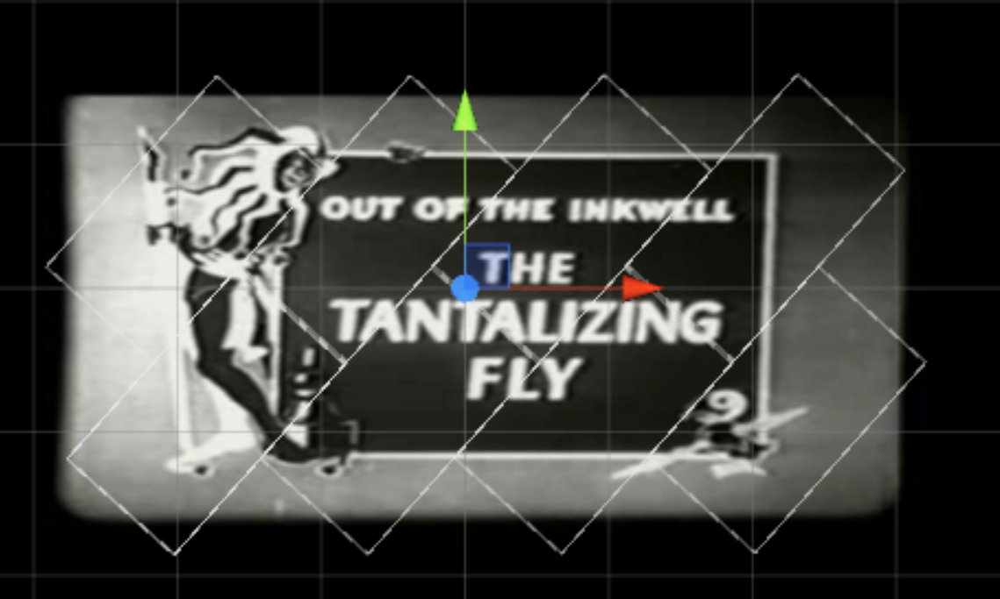
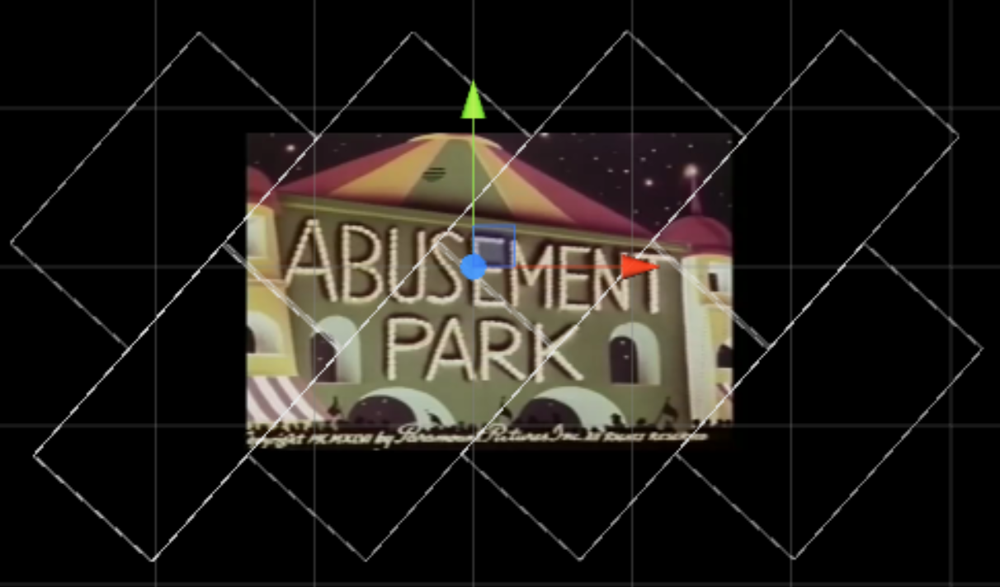
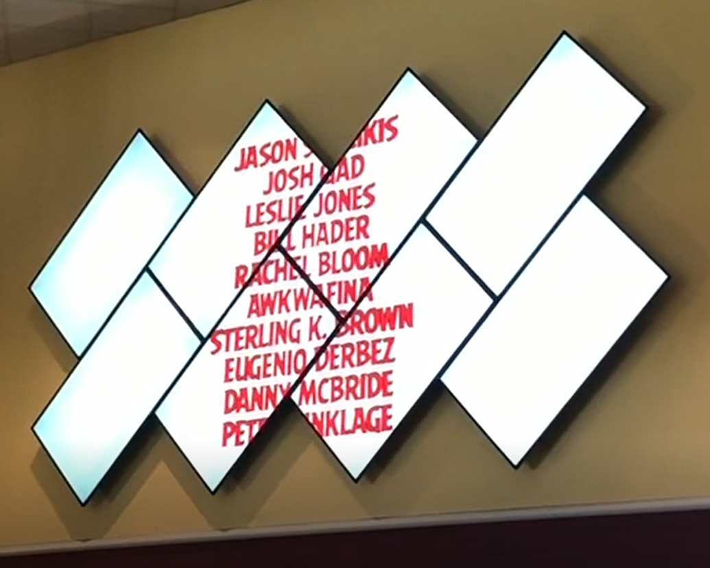

# Angled Multi-Display
Display video on an array of 8 angled monitors

   
   

Files source from a folder named "MultiDisplayVideos" on the Windows desktop. Played in series, alphabetically.

Filenames containing "_fit" will play in "fit mode," where the video is sized to be fully visible on the video wall, leaving some negative space on-screen, outside of the interior frame. Otherwise, videos are shown in "flood mode," where some border areas are out of view, due to the uneven borders of the video wall.

